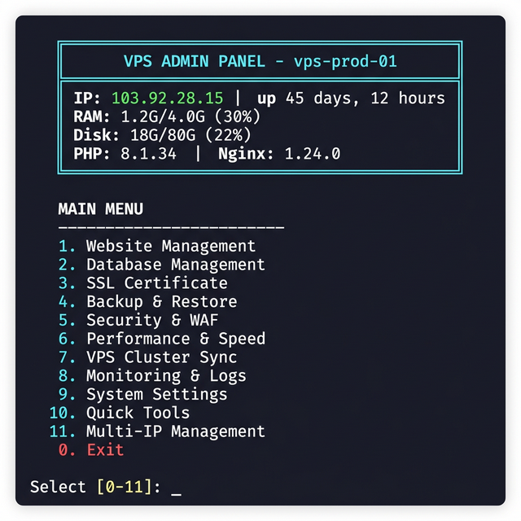
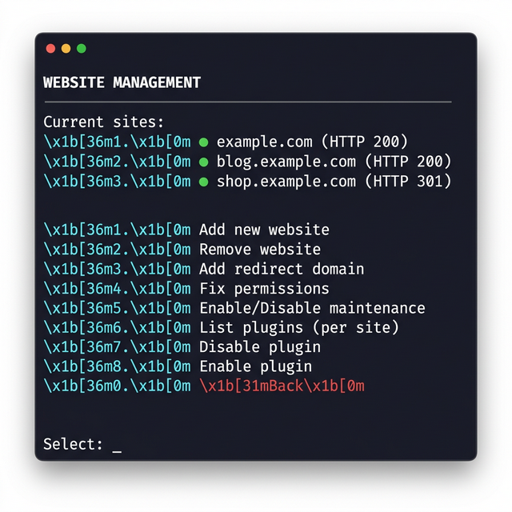
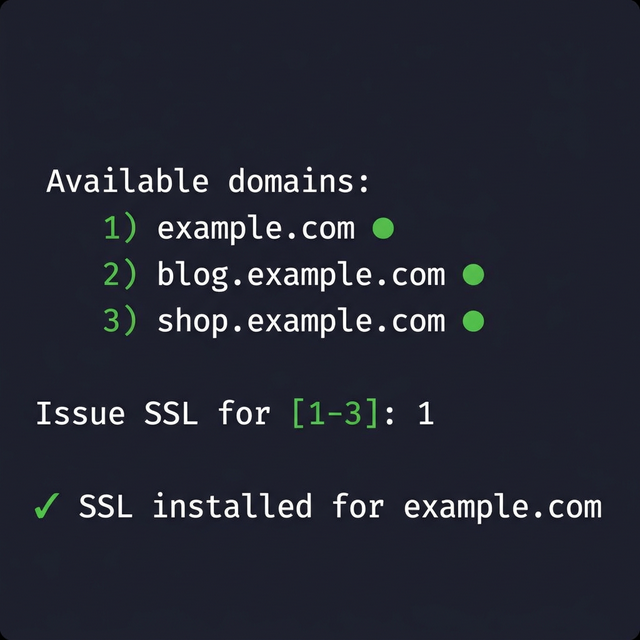
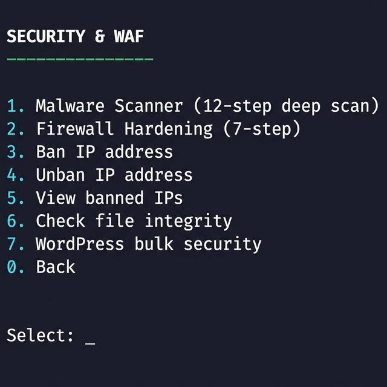
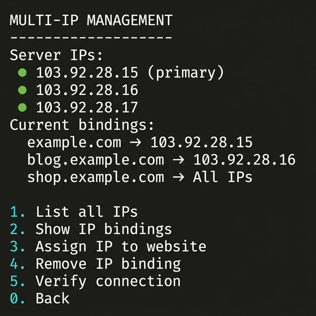

# VPS Manager v2.1.0

<div align="center">



**All-in-one VPS management toolkit for LEMP + WordPress servers**

[](https://github.com/hugnanastore-eng/vps-manager/releases)
[](LICENSE)
[]()
[]()
[]()

**11 Menus** · **9 Modules** · **39 Security Validations** · **One-Command Install**

[Quick Install](#-quick-install) · [Features](#-features) · [New in v2.1](#-new-in-v21) · [Architecture](#-architecture) · [Support](#-support)

</div>

---

## ⚡ Quick Install

```bash
curl -sO https://raw.githubusercontent.com/hugnanastore-eng/vps-manager/main/scripts/install.sh && bash install.sh
```

Or update an existing installation:

```bash
vps-update update
```

> **Requirements**: Ubuntu 20.04/22.04 LTS or Rocky Linux 8/9, root access, clean VPS or existing LEMP stack.

---

## 🆕 New in v2.1

### 8 Powerful Modules Added

| Module | What it does |
|--------|-------------|
| 🗄️ **Per-table Split Dump** | Dump từng bảng MySQL riêng biệt, SHA256 checksum, retry 3 lần — an toàn cho DB hàng GB |
| 🔄 **WordPress Auto-Update** | Backup → update core/plugins/themes → verify HTTP → auto-rollback nếu lỗi |
| 📟 **Resource Alert** | Cảnh báo Telegram: RAM/Disk/CPU/Swap vượt ngưỡng, cooldown 30 phút, cron tự động |
| 🧹 **Disk Cleanup** | Dry-run trước, dọn logs cũ, WP revisions/transients/spam, hiển thị dung lượng thu hồi |
| 🔑 **SSH Key Manager** | Thêm/xóa SSH key, validate format, chống lockout, toggle password auth + auto-rollback |
| 🩺 **Domain Health** | Dashboard 1 lệnh: HTTP status, SSL hạn, TTFB, DB size, disk usage cho từng site |
| 🚧 **WP Staging** | Clone WordPress sang staging.domain.com + .htpasswd bảo vệ, xóa staging an toàn |
| 📊 **Simple Analytics** | Phân tích nginx logs: top pages, IPs, bandwidth, bot vs human, 404 errors — không cần tool ngoài |

### Tested with Real Data

```
✅ Split Dump:   119/119 tables dumped in 4s (shirtf.com — 44MB, 583MB uncompressed)
✅ Checksums:    120/120 SHA256 verified
✅ Restore:      119/119 tables restored in 26s
✅ Data Match:   Top 5 tables row-by-row: 100% identical
```

---

## 🎯 Features

### 11-Menu Admin Panel

| # | Menu | Description |
|---|------|-------------|
| 1 | **Website Management** | Add/remove sites, redirects, fix permissions, maintenance mode, manage plugins |
| 2 | **Database Management** | Create, delete, import, export MySQL databases with auto-credential generation |
| 3 | **SSL Certificate** | Let's Encrypt auto-issue, renew, list, and expiry checking |
| 4 | **Backup & Restore** | Daily automated backups, cross-VPS sync, **per-table split dump** |
| 5 | **Security & WAF** | Malware scanner (12-step), firewall hardening (7-step), IP ban/unban, fail2ban |
| 6 | **Performance & Speed** | Redis/Memcached toggle, PHP OPcache, Nginx fastcgi cache, Gzip/Brotli |
| 7 | **VPS Cluster Sync** | Multi-VPS backup sync, cross-server migration, cluster node management |
| 8 | **Monitoring & Logs** | Health checks, TTFB, debug logs, **domain health dashboard**, **simple analytics** |
| 9 | **System Settings** | PHP version switch, Nginx config, SSH security, swap management |
| 10 | **Quick Tools** | Disk cleanup, resource alerts, **WP auto-update**, **SSH key manager**, **WP staging** |
| 11 | **Multi-IP Management** | Assign specific IPs to websites, view IP→domain bindings |

### CLI Mode

Run any feature directly from command line without entering the interactive menu:

```bash
vps-admin backup-split    # Per-table split dump
vps-admin health          # Domain health dashboard
vps-admin analytics       # Nginx access log analytics
vps-admin cleanup         # Disk cleanup
vps-admin resource-check  # Resource monitoring
vps-admin wp-update       # WordPress auto-update
```

### Smart Installer

The installer automatically detects your existing environment and adapts:

- **Fresh VPS**: Full LEMP stack installation (Nginx, PHP 8.x, MariaDB, Redis, etc.)
- **Existing Setup**: Detects what's already installed, skips duplicates, adds missing components
- **Update Mode**: Compares versions, updates only changed components
- **Compatible with**: HocVPS, aaPanel, CyberPanel, manual LEMP setups

### 39 Security Validations

Every user input that touches commands, file paths, database names, or config files is validated:

- **Domain names**: `validate_domain()` — prevents path traversal & injection
- **IP addresses**: `validate_ip()` — octet range validation (0-255)
- **Database names**: `validate_dbname()` — `^[a-zA-Z0-9_]+$` only
- **SSH keys**: Format validation + injection char blocking (`;&|$\``)
- **Plugin names**: `validate_plugin()` — alphanumeric + hyphen/underscore only
- **File permissions**: `chmod 600` on all credential files
- **sshd config**: Backup + `sshd -t` validate before restart + auto-rollback

---

## 📸 Screenshots

<div align="center">

### Main Admin Panel


### Website Management


### Domain Picker


### Security & WAF


### Multi-IP Management


</div>

---

## 🏗 Architecture

```
vps-manager/
├── scripts/
│   ├── install.sh              # Smart installer (detect → install → update)
│   ├── vps-admin.sh            # 11-menu admin panel (1,433 lines)
│   ├── vps-setup.sh            # WordPress/LEMP automated setup
│   └── modules/
│       ├── multi-ip.sh         # Multi-IP management (273 lines)
│       ├── backup_split.sh     # Per-table MySQL dump (348 lines)
│       ├── wp_auto_update.sh   # WordPress auto-update (264 lines)
│       ├── resource_alert.sh   # Resource monitoring (209 lines)
│       ├── disk_cleanup.sh     # Disk cleanup (205 lines)
│       ├── ssh_key_manager.sh  # SSH key management (223 lines)
│       ├── domain_health.sh    # Domain health dashboard (118 lines)
│       ├── wp_staging.sh       # WordPress staging (246 lines)
│       └── simple_analytics.sh # Nginx log analytics (223 lines)
└── version.txt                 # Current version (2.1.0)
```

### Modular Design

New features are developed as separate `.sh` files in the `modules/` directory. The admin panel automatically loads all modules at startup:

```bash
# Module auto-loader in vps-admin.sh
for _mod in /usr/local/bin/vps-modules/*.sh; do
    [ -f "$_mod" ] && source "$_mod"
done
```

This allows:
- ✅ Independent development and testing of each module
- ✅ Easy feature toggling (just add/remove the `.sh` file)
- ✅ Graceful fallback if a module isn't installed
- ✅ Zero downtime updates for individual features

---

## 📊 Comparison

| Feature | Manual Setup | Other Scripts | **VPS Manager** |
|---------|:---:|:---:|:---:|
| One-command install | ❌ | ✅ | ✅ |
| Smart detection (existing setup) | ❌ | ❌ | ✅ |
| 11 admin menus | ❌ | 3-5 | **11** |
| 9 modular plugins | ❌ | ❌ | ✅ |
| Input validation (39 checks) | ❌ | ❌ | ✅ |
| Per-table DB split dump | ❌ | ❌ | ✅ |
| WordPress auto-update + rollback | ❌ | ❌ | ✅ |
| SSH key manager + lockout prevention | ❌ | ❌ | ✅ |
| Domain health dashboard | ❌ | ❌ | ✅ |
| Nginx log analytics (no external tools) | ❌ | ❌ | ✅ |
| WP staging with .htpasswd | ❌ | ❌ | ✅ |
| Multi-IP binding | ❌ | ❌ | ✅ |
| Malware scanner (12-step) | ❌ | Basic | ✅ |
| Cluster sync | ❌ | ❌ | ✅ |
| Auto backup + cross-VPS | ❌ | Partial | ✅ |

---

## 🔧 Configuration

After installation, config files are stored in `/root/.vps-config/`:

```
/root/.vps-config/
├── setup.conf          # Main config (SERVER_IP, DOMAINS, DB_ROOT_PASS)
├── version             # Installed version
├── components.json     # Installed components tracking
├── db-credentials.txt  # Database credentials (chmod 600)
└── cluster/
    └── nodes.conf      # Cluster node definitions
```

---

## 🔐 Security

This project takes security seriously:

- **No `eval` or `exec`** — no dynamic code execution
- **No `rm -rf /`** — safe deletion patterns only, all variables quoted
- **All inputs validated** before use in any command
- **Backup before destructive operations** — auto-backup before removing sites/databases
- **Nginx config test** (`nginx -t`) before any reload, with auto-rollback on failure
- **sshd config validation** (`sshd -t`) before restart, auto-restore on failure
- **SSH key injection protection** — blocks `;&|$\`` characters
- **DB name sanitization** — regex `^[a-zA-Z0-9_]+$` prevents SQL injection
- **Credential files** protected with `chmod 600`
- **Staging sites** validated with `^staging\.[a-zA-Z0-9._-]+$` regex before any deletion

---

## 📋 Changelog

See [CHANGELOG.md](CHANGELOG.md) for version history.

---

## ☕ Support

If this tool saves you time, consider buying me a coffee!

<div align="center">

[](https://paypal.me/HoangDuong)

</div>

> Every contribution helps maintain and improve this project. Thank you! 🙏

---

## 📄 License

This project is licensed under the MIT License - see the [LICENSE](LICENSE) file for details.

---

<div align="center">

**Made with ❤️ for the VPS community**

⭐ Star this repo if you find it useful!

</div>
